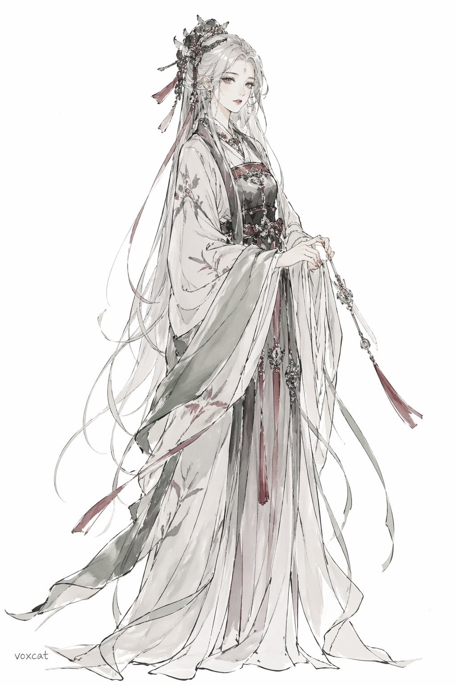
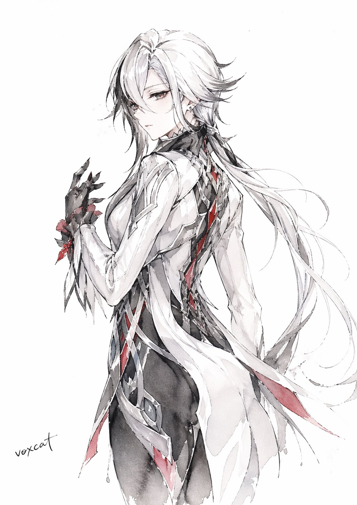

# voxcat书写性线性人物彩色插画

- **分类**: character-design
- **作者**: @voxcat
- **来源**: X (Twitter) - https://x.com/voxcat
- **标签**: 书写性, 线性, 白描, 毛笔, 水彩, 留白, voxcat, image2
- **收录时间**: 2026-04-23
- **状态**: ✅ 已收录（由 Keduoli03 审批通过）

## 提示词原文

【角色/主题】，东亚书写性线性人物彩色插画，白描骨架，线描主导，写意淡设色，毛笔墨线，兼毫笔触，中锋行笔，局部侧锋擦出，飞白笔意，枯笔质感，游丝描发丝，开放式轮廓，断续复线，虚实相生，书写性强，线性优先，笔意主导造型，大面积留白，白底纸面构图，计白当黑，纸地参与画面呼吸，透明水彩罩染，淡墨晕染，局部没骨式铺色，综合色调依据【角色】自动适配，形成统一、完整、清透的彩色完成稿，色层通透，色块纯净，边缘柔和，最小明暗提示，散射光感，弱对比，平面化设色逻辑，人物服装、发型、配饰、身份特征严格依据【角色】本身设定生成，不额外附加汉服、仕女装、古装宽袖等固定服饰模板，重点保留角色原设服装逻辑、线描气质、留白结构与笔墨感，手部结构准确，五指完整清晰，手指数量正确，关节比例自然，手掌与手腕衔接合理，手势明确优雅，完整彩色绘制，人物服装、皮肤、头发、配饰均有清晰统一的色彩表达，画面仅保留专属签名「voxcat」，除此之外不出现任何文字、印章、题字、水印、字幕、标识。

## 风格要点 / 进阶技巧

白描骨架 / 毛笔墨线 / 飞白枯笔 / 游丝描发丝；透明水彩罩染 / 弱对比 / 平面化设色；大面积留白 / 计白当黑 / 纸地呼吸；手部结构精准 / 服装依原设 / 签名仅 voxcat

## 效果图

## 审批信息

- **GitHub Issue**: [#9](https://github.com/Keduoli03/prompt-archive/issues/9)
- **审批时间**: 2026-04-23
- **审批人**: Keduoli03
- **质量标签**: 质量-优质
