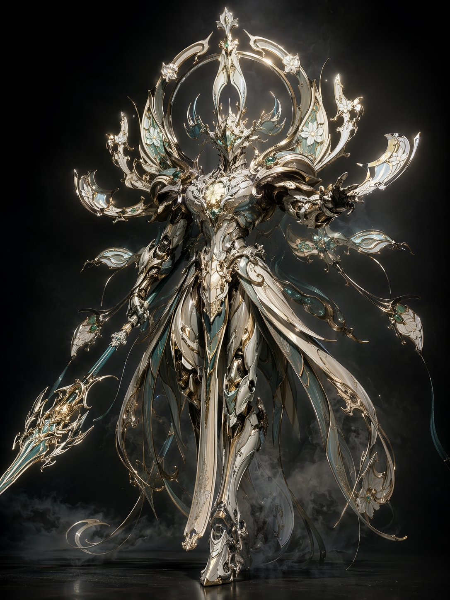
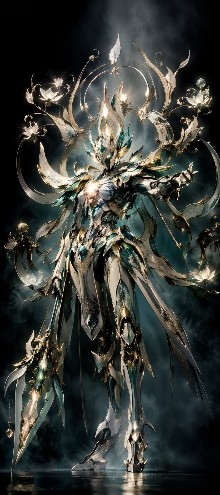

# 中式未来机甲圣像

- **分类**: concept-art
- **作者**: @voxcat
- **来源**: X (Twitter) - https://x.com/voxcat
- **标签**: 机甲, 神性机械, Art Nouveau, 中式, 新艺术, 花窗, 3D主视觉, image2
- **收录时间**: 2026-04-23
- **状态**: ✅ 已收录（由 Keduoli03 审批通过）

## 提示词原文

中式未来机甲圣像 / 新艺术法相主视觉，纯机甲主体，无人物，无驾驶员。融合中国风未来工业机甲与 Art Nouveau 的神性机械法相。整体结构保留东方礼器、冠饰、飞檐、云肩、玉器弧线，但所有线条流动优雅，像从金属与光中自然生长。蔓生曲线、花窗式弧线、藤蔓感结构、花形光环。花窗圣坛 + 有机金属生长气质。

姿态为「优雅而压迫」的神性战斗起势，中轴稳定，攻防步型，出手前高压静止瞬间。

构图低机位仰视，材质为抛光金属、珐琅、半透明晶体、玉石发光。色彩为象牙白、香槟金、月银、孔雀蓝、翡翠青。光影为柔和神性背光、边缘发光、黑场棚拍烟雾。

最终效果：顶级游戏神性机甲主视觉。不要普通军武机甲感，不要赛博朋克霓虹，不要人物，不要驾驶员。

## 风格要点 / 进阶技巧

融合中国风未来工业机甲与 Art Nouveau 神性机械法相；纯机甲主体无人物；花窗圣坛 + 有机金属生长气质

## 效果图

## 审批信息

- **GitHub Issue**: [#10](https://github.com/Keduoli03/prompt-archive/issues/10)
- **审批时间**: 2026-04-23
- **审批人**: Keduoli03
- **质量标签**: 质量-优质
