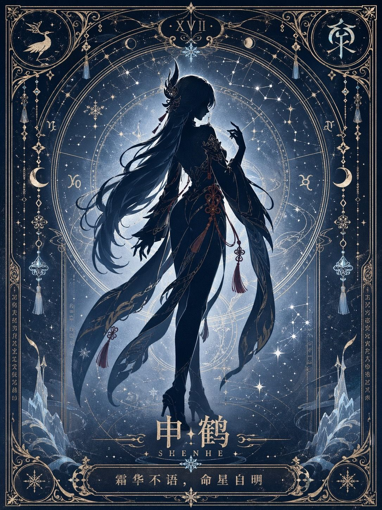
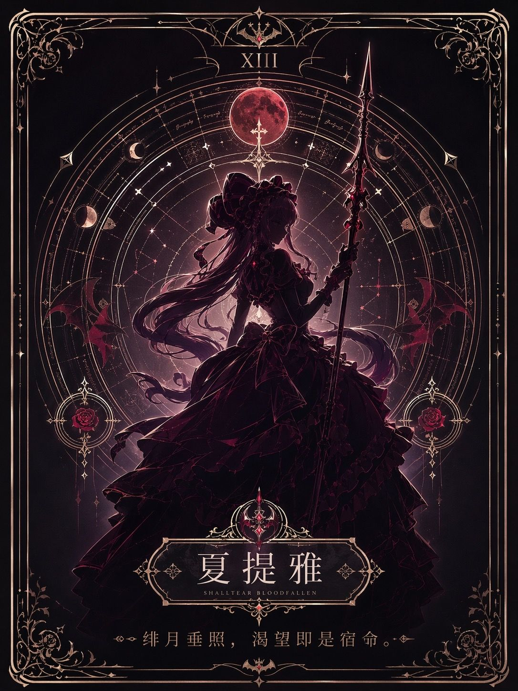

# 极简命运星盘/塔罗系列海报（Overlord角色剪影）

- **分类**: movie-poster
- **作者**: @xxx（来源：社交媒体分享）
- **来源**: 社交媒体帖子
- **标签**: 卡牌, overlord, 塔罗牌, image2
- **收录时间**: 2026-04-23
- **状态**: ✅ 已收录（由 Keduoli03 审批通过）

## 提示词原文

根据【角色/主题】生成一张收藏级极简命运星盘 / 塔罗海报。画面中央为该角色巨大、优雅、完整的人物剪影式主视觉，整体保留强烈剪影感，但不是纯黑剪影，而是带有角色主题色倾向的低饱和、有色、偏暗的半剪影；内部只保留非常克制的颜色层次、轻微渐变与微弱辉光，不做完整上色立绘。人物主要通过轮廓、姿态、发型、服饰外形与标志性配饰体现角色辨识度，不强调具体五官，不在剪影内部填充场景，不做叙事拼贴。

人物背后自动生成与【角色】高度匹配的专属星盘 / 命盘系统，包括同心圆、星轨、黄道刻度、星座连线、月相、神秘符号、几何占星纹样、象征徽记与少量装饰细节。所有配色、纹样、符号系统、装饰元素、材质倾向与光感氛围，全部根据【角色】的身份、气质、能力、阵营、元素属性、世界观与命运感自动推演生成，必须强绑定角色本身，不得模板化。

整体采用严格对称、完整克制的收藏版塔罗牌构图，具有完整边框、角饰、顶部编号区、中部主视觉区、底部角色名铭牌与箴言区。风格融合塔罗构图、新艺术装饰风格、神秘学符号设计与高级极简电影海报审美，整体庄重、神圣、安静、精致、宿命、诗意，具有收藏感与专属感。

整体质感应干净、通透、锐利、精工、华丽，装饰线条清晰细腻，可带有微弱辉光、星尘、能量光纹或金属饰线感；不要纸张纹理，不要纸绘感，不要古旧纸面，不要印刷噪点，不要版画肌理，不要手稿感，不要做旧质感。

画面文字自然融入版式：顶部可有罗马数字或命运编号，中下部呈现【角色】名字，底部加入一句与角色气质高度契合的命运箴言 / 神谕短句，简洁、克制、诗性，像专属于该角色的命运注解。

不要复杂场景，不要剪影内部叙事，不要额外人物，不要模板化背景，不要现代UI，不要廉价奇幻素材，不要过度拥挤，不要失去留白，不要普通角色插画感，不要纯黑剪影，不要完整厚涂立绘感。

竖版 3:4，高清，收藏级，高完成度，精致细节。

## 效果图

## 备注

适合 Overlord 系列角色（安兹、雅儿贝德、夏提雅、迪奥、申鹤等），适合印烫金卡面风格。

## 审批信息

- **GitHub Issue**: [#8](https://github.com/Keduoli03/prompt-archive/issues/8)
- **审批时间**: 2026-04-22
- **审批人**: Keduoli03
- **质量标签**: 质量-优质
