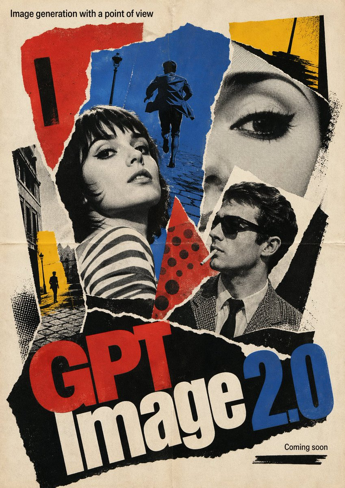

# 9. 1960s French New Wave Theatrical Poster

> **分类**: movie-poster
> **作者**: dotey
> **来源**: X (Twitter) - https://x.com/dotey/status/2046783507511287906
> **标签**: gpt-image-2
> **收录时间**: 2026-04-24
> **Issue**: #142

## 提示词原文

```
1960s French New Wave theatrical poster, bold photomontage composition, torn-paper collage sensibility, pop-art color bursts, high-contrast black-and-white imagery with selective red blue and yellow accents, hand-made offset-print texture, slightly off-register ink, expressive asymmetry, art-house poster cool, graphic spontaneity, street-poster energy, adventurous typography-led design.

Poster text:
- Large title at the bottom: "BananaPro AI"
- Smaller headline at the top: "Free AI Image generation tool"
- Small subtitle text: "GPT Image 2.0 Arrived."
Keep all visible in English. Use a theatrical poster composition.
```

## 效果图



来源: https://gptimages.photos/prompts/dotey-movie-poster
